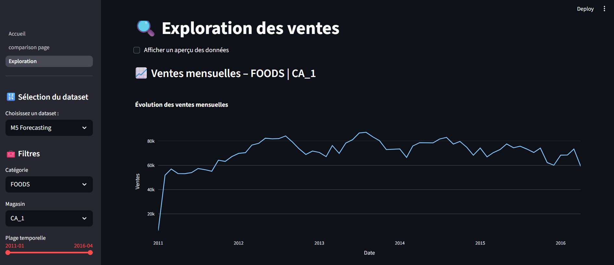
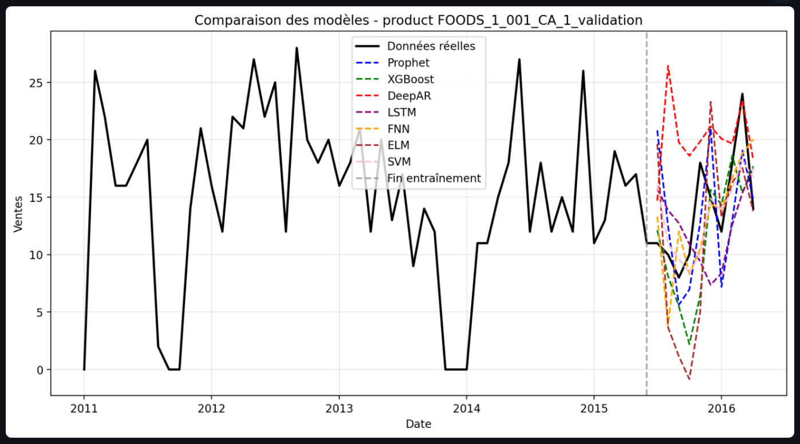
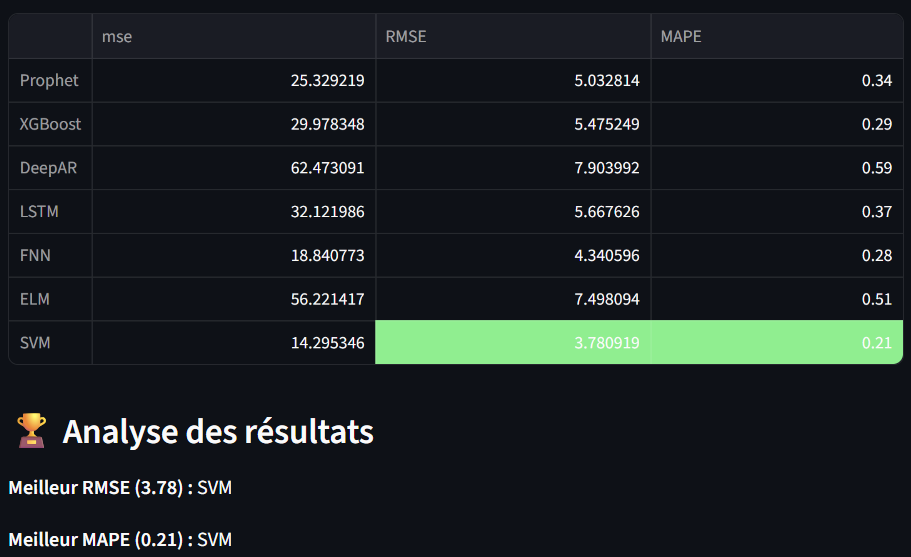

# RetailPredict - Prévision de la Demande dans le Commerce de Détail

## 📋 Description  
Application interactive de prévision des ventes développée dans le cadre d'un TER (Master 1 DSC). L'outil permet de prédire la demande à différentes granularités (produit, catégorie, magasin) en comparant plusieurs modèles de séries temporelles.

## ✨ Fonctionnalités  
- **Exploration interactive** des données (M5 Forecasting ou données synthétiques) 

<!--  -->
<div align="center">
  
</div>

- **Prévisions avec 7 modèles** : Prophet, XGBoost, LSTM, DeepAR, FNN, SVM, ELM
  
<div align="center">
  
</div>

- **Comparaison visuelle** des performances et métriques (MSE, RMSE, MAPE)  

<div align="center">
  
</div>

- **Interface intuitive** développée avec Streamlit

## 📊 Données utilisées 
1. **Données synthétiques** : générées avec tendance, saisonnalité et bruit contrôlés  
2. **M5 Forecasting** : données réelles de ventes Walmart (Kaggle)
NB : Les données étant trop volumineux ne sont pas dispo dans ce dépot, mais je peux vous les fournir à la demande par Discord (alphadiallo7716).

## 🛠️ Technologies  
- **Langage** : Python  
- **Interface** : Streamlit  
- **Modélisation** : Prophet, XGBoost, Scikit-learn, TensorFlow/Keras, GluonTS  
- **Traitement** : Pandas, NumPy  
- **Visualisation** : Matplotlib, Plotly  

## 🚀 Installation  
```bash
git clone https://github.com/alphambd/retail_predict.git
cd retail_predict
pip install -r requirements.txt
streamlit run app.py
```

## 📈 Résultats clés
Les modèles innovants implémentés dans ce projet ont donné une performance 
nettement supérieur par rapport aux modèles classique ARIMA, ES, etc.
avec un pourcentage allant de 17 à 35%.

- **Niveau produit** : SVM, Prophet, FNN et XGBoost les plus performants
- **Niveau catégorie** : MAPE < 10% pour tous les modèles
- **Niveau magasin** : XGBoost, LSTM et FNN en tête

## 👤 Auteur
Alpha DIALLO – Master 1 DSC 2024-2025, Université Jean Monnet

Directeur de projet : M. Jacquenet François

## 📄 Licence
Projet académique. Données M5 sous licence Kaggle.
